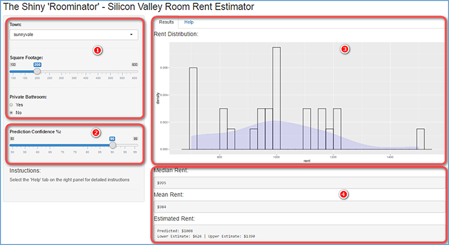

## What is the "Shiny Roominator App" ?
Want to rent a room but don't know the going rental costs? The 'Shiny Roominator" is a room rent estimator App for people looking to rent a room in the California Silicon Valley. 
### Inputs
* Town where the room is located
* Size of the room in sqft
* Whether the room has a private bathroom
* Desired prediction confidence percentage

### Outputs
* Histogram and dsnsity plot
* Mean and median rents
* Estimated price for the parameters selected with Upper/Lower bounds

--- .class #id 

## The Dataset
The author collected rent data from popular websites and built a dataset with the results.


```r
df <- readRDS('rents.Rds')
head(df)
```

```
##                      town sqft rent private
## 2          san jose south  145  850      NO
## 4               palo alto  130  950      NO
## 5           san jose east  320  895      NO
## 6 hayward / castro valley  130  900      NO
## 7               sunnyvale  170 1150      NO
## 8          san jose south  120  750      NO
```

---

## How it works

The rents.Rds dataset is used to build a simple linear prediction model based on the 'Inputs':


```r
# read rents data
df <- readRDS('rents.Rds')
# Build linear model. This code runs only once since it's outside the i/o function
fit <- lm(rent ~ sqft + private + town, data = df)
```
* A rent prediction including upper and lower prediction interval bounds is displayed based on the
confidence level the user selected:

  + 1. Using the Left panel, select the town where the room is located, the room size ('square footage'), and whether or not the room has a private bathroom.
  + 2. Select a confidence level for the rent prediction. The lower the confidence, the narrower the resulting prediction interval will be.
  + 3. The right panel displays an histogram for the datapoints found in the dataset matching the left panel selections. A density plot estimate is overlayed with the histogram (you can think of this as an "estimate' of the underlying rent price distribution).
  + 4. The median, mean and predicted rents are calculated and displayed on the right panel.

---

## Interface


